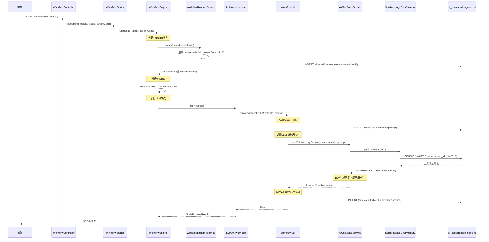

# AI工作流多轮对话上下文记忆功能设计方案

**文档版本**: v1.0
**创建日期**: 2025-01-07
**设计者**: SCM-AI Team
**审批状态**: 待审批

---

## 一、需求背景

### 1.1 业务场景

在AI工作流执行过程中，多个LLM节点需要共享对话上下文，实现连贯的多轮对话能力。

**典型场景示例**：
```
工作流Runtime实例: runtime-uuid-123
├─ 节点1 (LLM): 用户输入 "我叫小王"
│   └─ AI回复: "好的，小王你好！"
├─ 节点2 (LLM): 用户输入 "我是谁"
│   └─ AI回复: "你叫小王" ← 需要记住节点1的对话内容
```

### 1.2 现状问题

**当前实现**：
- AI Workflow中的LLM节点使用无记忆模式（`chatStream()`）
- 每个LLM节点调用都是独立的，无法访问同一runtime中其他节点的对话历史
- 工作流运行实例（`ai_workflow_runtime`）缺少`conversation_id`字段

**问题影响**：
- 无法实现工作流内的多轮对话场景
- 用户体验不连贯（AI无法记住之前说过的内容）

---

## 二、调用链路分析

### 2.1 现有调用链路（无记忆）

```
前端发起工作流执行
  ↓
WorkflowController.run(wfUuid, inputs)
  ↓
WorkflowStarter.streaming()
  ├─ 生成executionId
  ├─ 创建Flux流
  └─ asyncRunWorkflow()
      ↓
      WorkflowEngine.run(userId, inputs, tenantCode)
        ├─ workflowRuntimeService.create(userId, workflowId)
        │   └─ 插入 ai_workflow_runtime (无conversation_id)
        ├─ 创建 WfState(userId, inputs, runtimeUuid, tenantCode)
        └─ 执行工作流节点
            ↓
            LLMAnswerNode.onProcess()
              ↓
              WorkflowUtil.streamingInvokeLLM(wfState, nodeState, node, modelName, prompt)
                ↓
                AiChatBaseService.chatStream(chatOption)  ← 无记忆模式
                  └─ LLM返回回复
```

### 2.2 目标调用链路（带记忆）

```
前端发起工作流执行
  ↓
WorkflowController.run(wfUuid, inputs)
  ↓
WorkflowStarter.streaming()
  └─ asyncRunWorkflow()
      ↓
      WorkflowEngine.run(userId, inputs, tenantCode)
        ├─ workflowRuntimeService.create(userId, workflowId)
        │   ├─ 生成 conversation_id = "tenantCode::UUID"
        │   └─ 插入 ai_workflow_runtime (含conversation_id)
        ├─ 创建 WfState(..., conversationId)  ← 新增conversationId
        └─ 执行工作流节点
            ↓
            LLMAnswerNode.onProcess()
              ↓
              WorkflowUtil.streamingInvokeLLM(wfState, ...)
                ├─ 保存USER消息 → ai_conversation_content  ← 新增
                ├─ AiChatBaseService.chatWithMemoryStream(conversationId)  ← 改用带记忆
                │   └─ ScmMessageChatMemory.get(conversationId)
                │       └─ 查询 ai_conversation_content (最近10条)
                ├─ LLM基于历史生成回复
                └─ 保存ASSISTANT消息 → ai_conversation_content  ← 新增
```

---

## 三、问题诊断与根因分析

### 3.1 根本原因

1. **数据结构缺失**：`ai_workflow_runtime`表缺少`conversation_id`字段，无法关联对话历史
2. **服务逻辑缺失**：未生成和传递conversationId到工作流执行上下文
3. **LLM调用方式**：使用无记忆的`chatStream()`而非`chatWithMemoryStream()`
4. **对话内容未持久化**：工作流中的LLM问答未保存到`ai_conversation_content`表

### 3.2 为什么现有AI Chat有记忆，而Workflow没有？

**AI Chat架构**：
```java
// AI Chat Controller
AiConversationController.chatStream(conversationId, prompt)
  → aiConversationService.chatStreamWithCallback(request, userId, streamHandler)
    → aiChatBaseService.chatWithMemoryStream(aiChatOption)  // 带conversationId
      → ScmMessageChatMemory.get(conversationId)  // 自动查询历史
```

**AI Workflow架构**（当前）：
```java
// Workflow执行
WorkflowUtil.streamingInvokeLLM(...)
  → aiChatBaseService.chatStream(chatOption)  // 无conversationId参数
    → 直接调用LLM，无历史查询
```

**差异点**：
- AI Chat：前端传入conversationId → 后端使用带记忆模式
- Workflow：前端未传conversationId → 后端无从获取历史

---

## 四、方案设计

### 4.1 设计原则

遵循 **KISS原则**：
1. ✅ **这是个真问题**：工作流多轮对话是实际业务需求
2. ✅ **最简方案**：复用现有对话历史基础设施，不重复造轮
3. ✅ **零破坏性**：新增字段允许NULL，向后兼容
4. ✅ **功能必要性**：开启工作流对话连贯能力

### 4.2 总体架构

```
┌─────────────────────────────────────────────────────────────┐
│                    AI Workflow Runtime                       │
├─────────────────────────────────────────────────────────────┤
│  runtime_uuid: abc-123                                       │
│  conversation_id: tenant001::conv-uuid-456  ← 新增字段       │
│  workflow_id: 100                                            │
│  user_id: 1001                                               │
└─────────────────────────────────────────────────────────────┘
                            │
                            │ 1:1 关联
                            ↓
┌─────────────────────────────────────────────────────────────┐
│               AI Conversation (对话会话)                      │
├─────────────────────────────────────────────────────────────┤
│  id: tenant001::conv-uuid-456                                │
│  title: "工作流对话"                                          │
│  ai_config_id: null                                          │
└─────────────────────────────────────────────────────────────┘
                            │
                            │ 1:N
                            ↓
┌─────────────────────────────────────────────────────────────┐
│          AI Conversation Content (对话内容)                   │
├─────────────────────────────────────────────────────────────┤
│  conversation_id: tenant001::conv-uuid-456                   │
│  type: USER                                                  │
│  content: "我叫小王"                                          │
│  model_source_id: model-123                                  │
├─────────────────────────────────────────────────────────────┤
│  conversation_id: tenant001::conv-uuid-456                   │
│  type: ASSISTANT                                             │
│  content: "好的，小王你好！"                                  │
│  model_source_id: model-123                                  │
├─────────────────────────────────────────────────────────────┤
│  conversation_id: tenant001::conv-uuid-456                   │
│  type: USER                                                  │
│  content: "我是谁"                                            │
│  model_source_id: model-123                                  │
├─────────────────────────────────────────────────────────────┤
│  conversation_id: tenant001::conv-uuid-456                   │
│  type: ASSISTANT                                             │
│  content: "你叫小王"  ← 基于历史记忆生成                      │
│  model_source_id: model-123                                  │
└─────────────────────────────────────────────────────────────┘
```

### 4.3 conversationId生成规则

**格式标准**：`tenantCode::UUID`

**示例**：
```java
String conversationId = tenantCode + "::" + UuidUtil.createShort();
// 结果: "tenant001::abc123def456"
```

**设计理由**：
- 与现有AI Chat的conversationId格式保持一致
- `tenantCode`前缀：支持多租户数据隔离
- `UUID`部分：确保全局唯一性
- `ScmMessageChatMemory.parseTenantId()`可直接解析

### 4.4 时序图



---

## 五、详细设计（按文件分类）

### 5.1 数据库层修改

#### 5.1.1 表结构变更

**表名**：`ai_workflow_runtime`

**新增字段**：
```sql
ALTER TABLE ai_workflow_runtime
ADD COLUMN conversation_id VARCHAR(200) DEFAULT NULL COMMENT '对话ID，格式：tenantId::uuid，关联ai_conversation表';

-- 创建索引（可选，提升查询性能）
CREATE INDEX idx_ai_workflow_runtime_conversation_id
ON ai_workflow_runtime(conversation_id);
```

**字段说明**：
- `conversation_id`：允许NULL，向后兼容旧数据
- 长度200：足够容纳 `tenantCode(50)::UUID(36)` + 冗余

#### 5.1.2 数据兼容性

**旧数据处理**：
- 已存在的runtime记录，conversation_id为NULL
- 运行时检测到NULL时，降级为无记忆模式

**新数据处理**：
- 新创建的runtime自动生成conversation_id
- 自动启用对话记忆功能

---

### 5.2 后端文件修改

#### 文件1：实体类 `AiWorkflowRuntimeEntity.java`

**路径**：`scm-ai/src/main/java/com/xinyirun/scm/ai/bean/entity/workflow/AiWorkflowRuntimeEntity.java`

**修改内容**：新增字段
```java
/**
 * 对话ID，用于多轮对话上下文管理
 * 格式：tenantCode::uuid
 * 关联ai_conversation表
 */
@TableField("conversation_id")
private String conversationId;
```

**修改位置**：在`userId`字段后面添加（约52行后）

---

#### 文件2：VO类 `AiWorkflowRuntimeVo.java`

**路径**：`scm-ai/src/main/java/com/xinyirun/scm/ai/bean/vo/workflow/AiWorkflowRuntimeVo.java`

**修改内容**：新增字段
```java
/**
 * 对话ID
 */
private String conversationId;
```

---

#### 文件3：Service `AiWorkflowRuntimeService.create()`

**路径**：`scm-ai/src/main/java/com/xinyirun/scm/ai/core/service/workflow/AiWorkflowRuntimeService.java`

**修改方法**：`create(Long userId, Long workflowId)`

**修改前**：
```java
public AiWorkflowRuntimeVo create(Long userId, Long workflowId) {
    AiWorkflowRuntimeEntity runtime = new AiWorkflowRuntimeEntity();
    runtime.setRuntimeUuid(UuidUtil.createShort());
    runtime.setUserId(userId);
    runtime.setWorkflowId(workflowId);
    runtime.setStatus(1); // 1-运行中
    runtime.setIsDeleted(false);
    // 不设置c_time, u_time, c_id, u_id, dbversion - 自动填充
    aiWorkflowRuntimeMapper.insert(runtime);
    // ...
}
```

**修改后**：
```java
public AiWorkflowRuntimeVo create(Long userId, Long workflowId) {
    AiWorkflowRuntimeEntity runtime = new AiWorkflowRuntimeEntity();
    runtime.setRuntimeUuid(UuidUtil.createShort());
    runtime.setUserId(userId);
    runtime.setWorkflowId(workflowId);
    runtime.setStatus(1); // 1-运行中
    runtime.setIsDeleted(false);

    // 生成对话ID，用于多轮对话上下文管理
    String tenantCode = DataSourceHelper.getCurrentDataSourceName();
    String conversationId = tenantCode + "::" + UuidUtil.createShort();
    runtime.setConversationId(conversationId);

    // 不设置c_time, u_time, c_id, u_id, dbversion - 自动填充
    aiWorkflowRuntimeMapper.insert(runtime);

    runtime = aiWorkflowRuntimeMapper.selectById(runtime.getId());

    AiWorkflowRuntimeVo vo = new AiWorkflowRuntimeVo();
    BeanUtils.copyProperties(runtime, vo);

    // 手动转换 JSON 字段
    if (StringUtils.isNotBlank(runtime.getInputData())) {
        vo.setInputData(JSON.parseObject(runtime.getInputData()));
    }
    if (StringUtils.isNotBlank(runtime.getOutputData())) {
        vo.setOutputData(JSON.parseObject(runtime.getOutputData()));
    }

    return vo;
}
```

**关键变更**：
1. 获取当前租户编码：`DataSourceHelper.getCurrentDataSourceName()`
2. 生成conversationId：`tenantCode + "::" + UuidUtil.createShort()`
3. 设置到实体：`runtime.setConversationId(conversationId)`

---

#### 文件4：工作流状态 `WfState.java`

**路径**：`scm-ai/src/main/java/com/xinyirun/scm/ai/workflow/WfState.java`

**修改内容1**：新增字段
```java
/**
 * 对话ID，用于LLM节点的多轮对话记忆
 */
private String conversationId;
```

**修改内容2**：修改构造函数
```java
// 修改现有构造函数，增加conversationId参数
public WfState(Long userId, List<NodeIOData> input, String uuid,
               String tenantCode, String conversationId) {
    this.input = input;
    this.userId = userId;
    this.uuid = uuid;
    this.tenantCode = tenantCode;
    this.conversationId = conversationId;  // 新增
}

// 子工作流构造函数也需要修改
public WfState(Long userId, List<NodeIOData> input, String uuid,
               String tenantCode, String conversationId,
               Set<String> parentExecutionStack) {
    this.input = input;
    this.userId = userId;
    this.uuid = uuid;
    this.tenantCode = tenantCode;
    this.conversationId = conversationId;  // 新增
    if (parentExecutionStack != null) {
        this.executionStack = new HashSet<>(parentExecutionStack);
    }
}
```

---

#### 文件5：工作流引擎 `WorkflowEngine.java`

**路径**：`scm-ai/src/main/java/com/xinyirun/scm/ai/workflow/WorkflowEngine.java`

**修改方法**：`run()`方法，约133行

**修改前**：
```java
// 工作流运行实例状态
this.wfState = new WfState(userId, wfInputs, runtimeUuid, tenantCode);
```

**修改后**：
```java
// 工作流运行实例状态（传入conversationId用于多轮对话）
String conversationId = this.wfRuntimeResp.getConversationId();
this.wfState = new WfState(userId, wfInputs, runtimeUuid, tenantCode, conversationId);
```

---

#### 文件6：工作流工具类 `WorkflowUtil.streamingInvokeLLM()`

**路径**：`scm-ai/src/main/java/com/xinyirun/scm/ai/workflow/WorkflowUtil.java`

**修改方法**：`streamingInvokeLLM()`

**当前实现**（约108-160行）：
```java
public static void streamingInvokeLLM(WfState wfState, WfNodeState nodeState,
                                       AiWorkflowNodeVo node, String modelName,
                                       String prompt) {
    // 获取模型配置
    AIChatRequestVo request = new AIChatRequestVo();
    request.setAiType("LLM");
    AiChatBaseService aiChatBaseService = SpringUtil.getBean(AiChatBaseService.class);
    var modelConfig = aiChatBaseService.getModule(request, null);

    // 构建聊天选项
    AIChatOptionVo chatOption = new AIChatOptionVo();
    chatOption.setModule(modelConfig);
    chatOption.setPrompt(prompt);

    // 调用LLM（无记忆）
    StringBuilder fullResponse = new StringBuilder();
    aiChatBaseService.chatStream(chatOption)
            .chatResponse()
            .doOnNext(chatResponse -> {
                String content = chatResponse.getResult().getOutput().getText();
                fullResponse.append(content);
                if (wfState.getStreamHandler() != null) {
                    wfState.getStreamHandler().sendNodeChunk(node.getUuid(), content);
                }
            })
            .blockLast();

    // 保存输出
    nodeState.addOutput(NodeIOData.createByText(..., fullResponse.toString()));
}
```

**修改后**：
```java
public static void streamingInvokeLLM(WfState wfState, WfNodeState nodeState,
                                       AiWorkflowNodeVo node, String modelName,
                                       String prompt) {
    log.info("invoke LLM (streaming), modelName: {}, prompt length: {}", modelName,
            StringUtils.isNotBlank(prompt) ? prompt.length() : 0);

    try {
        AIChatRequestVo request = new AIChatRequestVo();
        request.setAiType("LLM");
        request.setTenantId(wfState.getTenantCode());  // 设置租户ID

        AiChatBaseService aiChatBaseService = SpringUtil.getBean(AiChatBaseService.class);
        if (aiChatBaseService == null) {
            throw new RuntimeException("AiChatBaseService not found in Spring context");
        }

        var modelConfig = aiChatBaseService.getModule(request, null);

        // 构建聊天选项（带conversationId）
        AIChatOptionVo chatOption = new AIChatOptionVo();
        chatOption.setModule(modelConfig);
        chatOption.setPrompt(prompt);
        chatOption.setTenantId(wfState.getTenantCode());

        // 关键：设置conversationId以启用对话记忆
        String conversationId = wfState.getConversationId();
        chatOption.setConversationId(conversationId);

        StringBuilder fullResponse = new StringBuilder();

        // 1. 保存USER消息（在调用LLM之前）
        if (StringUtils.isNotBlank(conversationId)) {
            saveUserMessage(conversationId, prompt, modelConfig);
        }

        // 2. 调用LLM（带记忆模式）
        if (StringUtils.isNotBlank(conversationId)) {
            // 使用带记忆的流式聊天
            aiChatBaseService.chatWithMemoryStream(chatOption)
                    .chatResponse()
                    .doOnNext(chatResponse -> {
                        String content = chatResponse.getResult().getOutput().getText();
                        if (StringUtils.isNotBlank(content)) {
                            log.debug("LLM chunk: length={}", content.length());
                            fullResponse.append(content);

                            if (wfState.getStreamHandler() != null) {
                                wfState.getStreamHandler().sendNodeChunk(node.getUuid(), content);
                            }
                        }
                    })
                    .blockLast();
        } else {
            // 降级：无conversationId时使用无记忆模式
            log.warn("conversationId为空，降级为无记忆模式");
            aiChatBaseService.chatStream(chatOption)
                    .chatResponse()
                    .doOnNext(chatResponse -> {
                        String content = chatResponse.getResult().getOutput().getText();
                        if (StringUtils.isNotBlank(content)) {
                            fullResponse.append(content);
                            if (wfState.getStreamHandler() != null) {
                                wfState.getStreamHandler().sendNodeChunk(node.getUuid(), content);
                            }
                        }
                    })
                    .blockLast();
        }

        String response = fullResponse.toString();
        // 移除前导和尾随空白字符，避免Markdown渲染为代码块
        if (StringUtils.isNotBlank(response)) {
            response = response.trim();
        }
        log.info("LLM streaming response completed, total length: {}", response.length());

        // 3. 保存ASSISTANT消息（在LLM调用之后）
        if (StringUtils.isNotBlank(conversationId) && StringUtils.isNotBlank(response)) {
            saveAssistantMessage(conversationId, response, modelConfig);
        }

        // 4. 保存输出到节点状态
        nodeState.addOutput(NodeIOData.createByText(DEFAULT_OUTPUT_PARAM_NAME, "", response));

    } catch (Exception e) {
        log.error("invoke LLM failed", e);
        throw new RuntimeException("LLM 调用失败: " + e.getMessage(), e);
    }
}

/**
 * 保存USER消息到对话历史
 */
private static void saveUserMessage(String conversationId, String prompt,
                                    AiModelConfigVo modelConfig) {
    try {
        AiConversationContentService contentService =
            SpringUtil.getBean(AiConversationContentService.class);

        contentService.saveConversationContent(
            conversationId,
            "USER",
            prompt,
            String.valueOf(modelConfig.getId()),
            modelConfig.getProvider(),
            modelConfig.getModelName(),
            SecurityUtil.getStaff_id()
        );

        log.debug("保存USER消息成功, conversationId: {}", conversationId);
    } catch (Exception e) {
        log.error("保存USER消息失败", e);
        // 不抛出异常，避免影响主流程
    }
}

/**
 * 保存ASSISTANT消息到对话历史
 */
private static void saveAssistantMessage(String conversationId, String response,
                                         AiModelConfigVo modelConfig) {
    try {
        AiConversationContentService contentService =
            SpringUtil.getBean(AiConversationContentService.class);

        contentService.saveConversationContent(
            conversationId,
            "ASSISTANT",
            response,
            String.valueOf(modelConfig.getId()),
            modelConfig.getProvider(),
            modelConfig.getModelName(),
            SecurityUtil.getStaff_id()
        );

        log.debug("保存ASSISTANT消息成功, conversationId: {}", conversationId);
    } catch (Exception e) {
        log.error("保存ASSISTANT消息失败", e);
        // 不抛出异常，避免影响主流程
    }
}
```

**关键变更**：
1. 从`wfState`获取`conversationId`
2. 设置到`AIChatOptionVo`
3. 调用前保存USER消息
4. 改用`chatWithMemoryStream()`（带记忆）
5. 调用后保存ASSISTANT消息
6. 增加降级逻辑（conversationId为空时用无记忆模式）

**新增依赖引用**：
```java
import com.xinyirun.scm.ai.core.service.chat.AiConversationContentService;
import com.xinyirun.scm.bean.utils.security.SecurityUtil;
```

---

### 5.3 前端文件修改

**结论**：前端**无需修改**

**原因**：
- conversationId由后端在创建runtime时自动生成
- 前端只需发起工作流执行请求，无需传递conversationId
- 对话历史管理完全在后端处理

---

## 六、KISS原则4问题回答

### 6.1 这是个真问题还是臆想出来的？

✅ **真问题**

**证据**：
- 用户明确提出实际场景："我叫小王" → "我是谁"
- 工作流多轮对话是常见业务需求（客服机器人、知识问答）
- 现有架构确实缺乏对话记忆能力

### 6.2 有更简单的方法吗？

✅ **已是最简方案**

**对比分析**：
| 方案 | 复杂度 | 优点 | 缺点 |
|------|--------|------|------|
| **方案1（当前）**：复用ai_conversation表 | 低 | 完全复用现有基础设施 | 无 |
| 方案2：新建workflow_conversation表 | 中 | 隔离性更好 | 重复造轮、维护成本高 |
| 方案3：在WfState中临时存储 | 低 | 无数据库改动 | 对话不持久化、无法审计 |

**结论**：方案1是最简单且最合理的选择。

### 6.3 会破坏什么吗？

✅ **零破坏性**

**向后兼容性**：
- `conversation_id`字段允许NULL
- 旧runtime记录（conversation_id=NULL）继续运行
- 代码降级处理：检测到NULL时使用无记忆模式

**功能隔离性**：
- AI Chat的conversation与Workflow的conversation完全独立
- conversationId不同，数据不会混淆

### 6.4 当前项目真的需要这个功能吗？

✅ **确实需要**

**业务价值**：
- 提升工作流的对话连贯性和用户体验
- 支持复杂的多轮交互场景
- 与AI Chat功能对齐，保持产品一致性

---

## 七、风险分析与缓解措施

### 7.1 技术风险

#### 风险1：对话历史数据量增长

**风险描述**：工作流执行频繁时，`ai_conversation_content`表数据量快速增长

**影响程度**：中

**缓解措施**：
1. ScmMessageChatMemory默认只查询最近10条消息（已实现）
2. 定期归档历史对话数据（3个月前的数据迁移到归档表）
3. 添加对话自动清理机制（runtime删除时，关联对话可选择性删除）

#### 风险2：多租户数据隔离

**风险描述**：conversationId格式错误导致跨租户数据泄露

**影响程度**：高

**缓解措施**：
1. **强制格式校验**：conversationId必须包含`tenantCode::`前缀
2. **ScmMessageChatMemory.parseTenantId()**自动切换数据源
3. 单元测试覆盖多租户场景

#### 风险3：性能影响

**风险描述**：每次LLM调用前后都要查询和保存数据库，可能影响性能

**影响程度**：低

**缓解措施**：
1. 查询历史仅限最近10条（已优化）
2. 保存消息采用异步方式（不阻塞LLM调用）
3. 添加数据库索引：`idx_ai_conversation_content_conversation_id`

### 7.2 业务风险

#### 风险4：用户隐私

**风险描述**：工作流对话内容可能包含敏感信息

**影响程度**：中

**缓解措施**：
1. 遵循现有AI Chat的权限控制机制
2. 对话内容仅创建者可见（通过c_id字段控制）
3. 支持对话清空功能（参考AI Chat的clearConversationContent）

#### 风险5：对话混乱

**风险描述**：子工作流是否共享父工作流的conversationId？

**影响程度**：低

**缓解措施**：
1. **设计决策**：子工作流**不共享**父工作流的conversationId
2. 每个子工作流runtime有独立的conversationId
3. 避免不同工作流的对话内容混淆

---

## 八、测试验证方案

### 8.1 单元测试

**测试类**：`AiWorkflowRuntimeServiceTest`

**测试用例**：
```java
@Test
public void testCreateRuntimeWithConversationId() {
    // 设置租户上下文
    DataSourceHelper.use("tenant001");

    // 创建runtime
    AiWorkflowRuntimeVo vo = workflowRuntimeService.create(1001L, 100L);

    // 验证conversationId格式
    assertNotNull(vo.getConversationId());
    assertTrue(vo.getConversationId().startsWith("tenant001::"));
    assertTrue(vo.getConversationId().length() > 15);
}
```

### 8.2 集成测试

**测试场景**：工作流多轮对话

**测试步骤**：
1. 创建包含2个LLM节点的工作流
2. 节点1输入："我叫小王"
3. 节点2输入："我是谁"
4. 验证节点2的回复包含"小王"

**验证点**：
- runtime创建后conversation_id非空
- ai_conversation_content表有4条记录（2个USER + 2个ASSISTANT）
- 节点2的ASSISTANT消息包含节点1的上下文信息

### 8.3 性能测试

**测试指标**：
- LLM调用耗时增加 < 100ms（保存消息的开销）
- 100个并发工作流执行，数据库连接池正常

---

## 九、实施计划

### 9.1 开发任务分解

| 任务ID | 任务描述 | 预计工时 | 优先级 |
|--------|----------|----------|--------|
| T1 | 数据库表添加conversation_id字段 | 0.5h | P0 |
| T2 | 修改AiWorkflowRuntimeEntity和Vo | 0.5h | P0 |
| T3 | 修改AiWorkflowRuntimeService.create() | 1h | P0 |
| T4 | 修改WfState类和构造函数 | 0.5h | P0 |
| T5 | 修改WorkflowEngine.run() | 0.5h | P0 |
| T6 | 修改WorkflowUtil.streamingInvokeLLM() | 2h | P0 |
| T7 | 新增saveUserMessage/saveAssistantMessage | 1h | P0 |
| T8 | 单元测试编写 | 1h | P1 |
| T9 | 集成测试验证 | 1h | P1 |
| T10 | 性能测试 | 0.5h | P2 |

**总计**：约8.5小时

### 9.2 发布策略

**发布方式**：灰度发布

**阶段1**（10%用户）：
- 数据库执行DDL（添加字段）
- 后端代码部署
- 监控日志和性能指标

**阶段2**（50%用户）：
- 确认无异常后扩大范围
- 继续监控对话数据量增长

**阶段3**（100%用户）：
- 全量发布
- 发布后观察1周

---

## 十、总结

### 10.1 方案优势

1. ✅ **最小改动**：仅1个表+1个字段+6个文件
2. ✅ **完全复用**：利用现有对话历史基础设施
3. ✅ **零破坏性**：向后兼容，降级处理
4. ✅ **多租户安全**：遵循现有租户隔离机制
5. ✅ **功能对齐**：与AI Chat保持一致的用户体验

### 10.2 关键设计点

- **conversationId格式**：`tenantCode::UUID`
- **生成时机**：runtime创建时
- **传递路径**：RuntimeVo → WfState → WorkflowUtil
- **记忆模式**：`chatWithMemoryStream(conversationId)`
- **消息保存**：LLM调用前后保存USER和ASSISTANT

### 10.3 预期收益

- 工作流支持多轮对话，对话连贯性提升
- 用户体验改善（AI能记住上下文）
- 为后续工作流高级功能打下基础（如对话分支、历史回溯）

---

**文档状态**：✅ 设计完成，待审批

**下一步**：提交方案审批 → 通过后进入代码实施阶段
